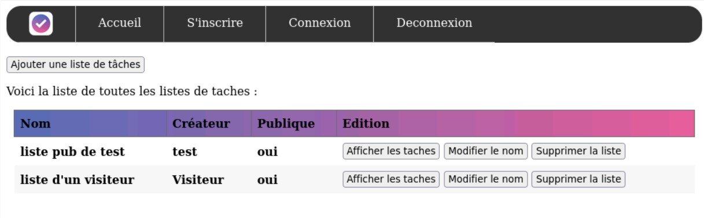

# PHP-ToDo-List

Projet PHP réalisé au cours de la 2ème année du Bachelor Universitaire de Technologie. 

Nous avons réalisé une To-Do liste dans laquelle on peut creer des listes composées de tâches. Ces listes peuvent être privées ou publique et il est possible de valider une tâche lorsque celle-ci est effectuée.  

## Techologies utilisées  

- PHP 
- SQL(PhpMyAdmin)
- HTML
- CSS
- JS

## Installation et utilisation
Commencez par cloner le depot  
Reproduire la base de donnée puis rentrer les logs (dsn, login et mot de passe) de celle-ci dans config/config.php
A l'iut nous passons par:
- ***londres.uca.local/phpmyadmin***  pour la base de donnée  
- ***londres.uca.local/~login/cheminDeVotreDepotCloné*** pour voir la page

## Fonctionnalitées

***!! Les actions suivantes sont disponibles par tous !!***
- Créer une To-Do List publique
- Modifier le nom d'une To-Do List publique
- Afficher les tâches d'une To-Do List publique
- Supprimer une To-Do List publique
- Ajouter une tâche à une To-Do List publique
- Modifier le nom d'une tâche et si elle est réalisée ou non pour une To-Do List publique
- S'inscrire
- Se connecter

***!! Les actions suivantes ne sont disponibles seulement si on est connecté !!***
- Créer un To-Do List privée de l'utilisateur connecté
- Modifier le nom d'une To-Do List privée de l'utilisateur connecté
- Afficher les tâches d'une To-Do List privée de l'utilisateur connecté
- Supprimer une To-Do List privée de l'utilisateur connecté
- Ajouter une tâche à une To-Do List privée de l'utilisateur connecté
- Modifier le nom d'une tâche et si elle est réalisée ou non pour une To-Do List privée de l'utilisateur connecté
- Se déconnecter

# --------------------------- English Version ---------------------------

PHP project carried out during the 2nd year of the University Bachelor of Technology.

We have created a To-Do list in which you can create lists made up of tasks. These lists can be private or public and it is possible to validate a task when it is performed.

## Technologies used

- PHP
- SQL(PhpMyAdmin)
- HTML
- CSS
- JS

## Installation and use

Start by cloning the repository  
Reproduce the database then enter the logs (dsn, login and password) of it in config/config.php
At the IUT we go through:
- ***londres.uca.local/phpmyadmin***  to access to the database
- ***londres.uca.local/~login/cheminDeVotreDepotCloné*** to see the web page

## Features

***!! The following actions are available to everyone !!!***
- Create a public To-Do List
- Modify the name of a public To-Do List
- Display the tasks of a public To-Do List
- Delete a public To-Do List
- Add a task to a public To-Do List
- Change the name of a task and whether it is done or not for a public To-Do List
- Sign up
- Sign in

***!! The following actions are only available if you are logged in!***
- Create a private To-Do List for the logged in user
- Change the name of a private To-Do List of the logged-in user
- Display the tasks of a private To-Do List of the logged-in user
- Delete a private To-Do List of the logged-in user
- Add a task to a private To-Do List of the connected user
- Change the name of a task and whether it is done or not for a private To-Do List of the logged-in user
- Log out
